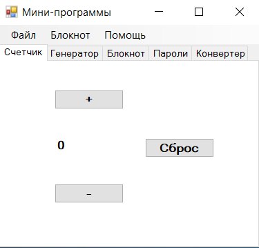
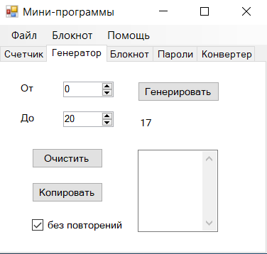
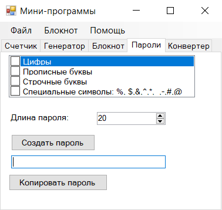
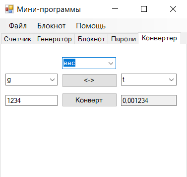

# Мини-программы

Программа состоит из разных вкладок полезных инструментов.
1. Счетчик.
2. Генератор.
3. Блокнот.
4. Пароли.
5. Конвертер.

# Счетчик

Счетчик позволяет вести счет по одному, в положительную сторону, либо в отрицательную.

# Генератор

Генератор позволяет генерировать случайное число в диапазоне.

# Пароли

Генератор паролей позволяет сгенерировать рандомный пароль с учетом настроек.

# Конвертер

Конвертер позволяет сконвертировать данные между единицами измерениями что по весу, что по длине.
